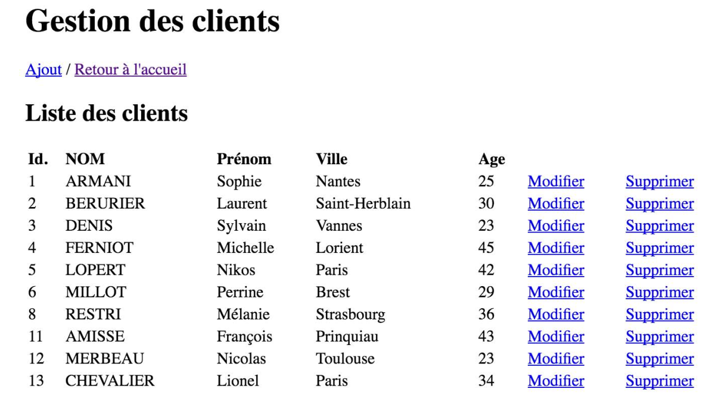
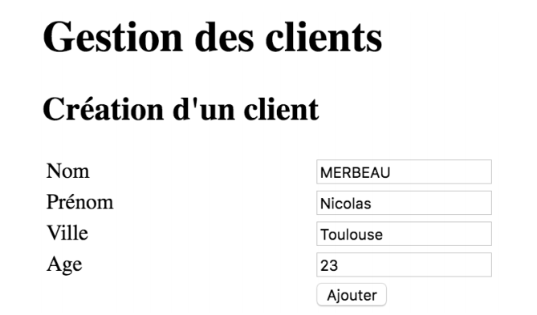
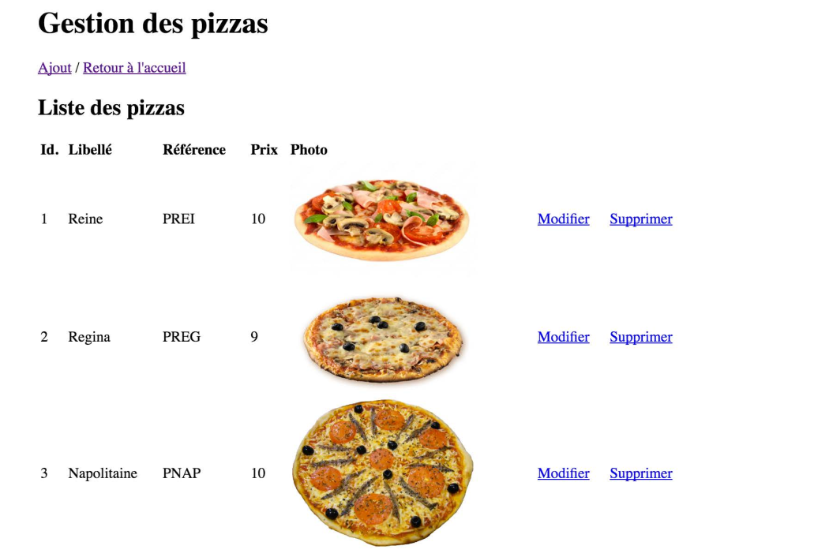
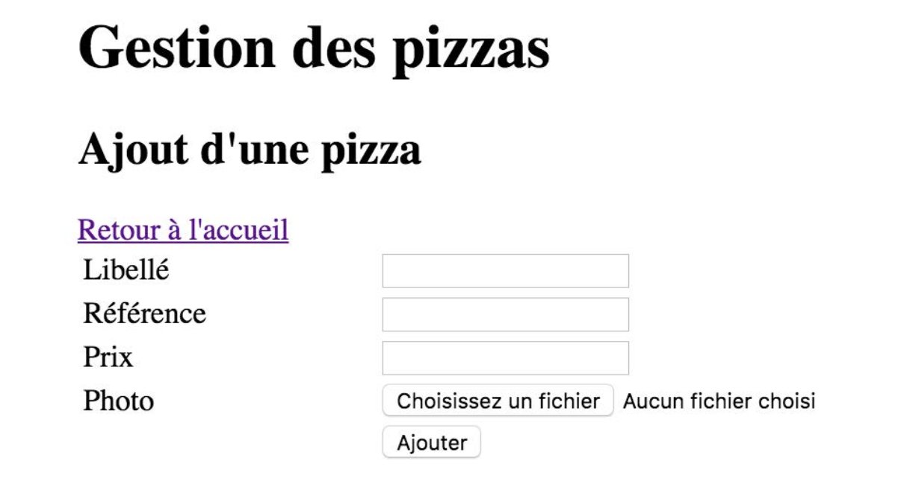
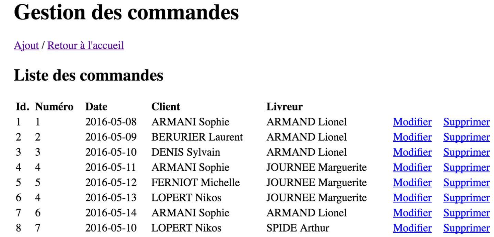
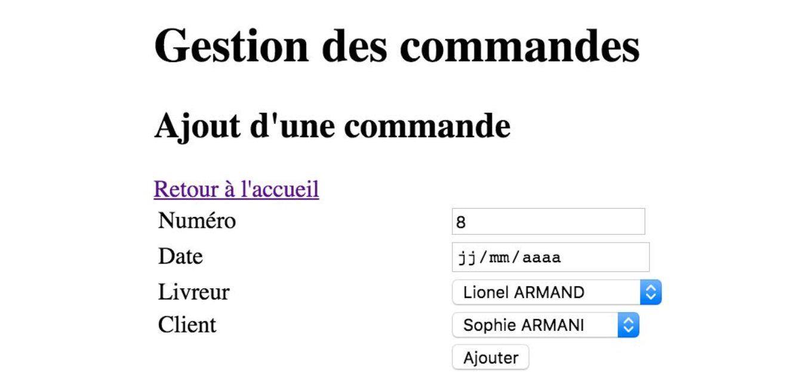

# Atelier Pizzeria

## Base de données

- Créer une base de données Pizzeria à partir du script `BDD_pizzeria.sql`.

- Vérifier que les tables suivantes sont bien créées :

  - `client`
  - `commande`
  - `commande_pizza`
  - `livreur`
  - `pizza`

- Vérifier que toutes les tables ont bien des données.

## Code Php

- Créer un fichier Demo.php

- Compléter ce fichier avec le contenu suivant (mettre à jour si nécessaire les informations de connexion) :

```php
<!DOCTYPE html>
<html lang="en">
<head>
   <meta charset="UTF-8">
   <meta name="viewport" content="width=device-width, initial-scale=1.0">
   <meta http-equiv="X-UA-Compatible" content="ie=edge">
   <title>Démo PHP</title>
</head>
<body>

<ul>
   <?php
       $mysqli = new mysqli("localhost:3306", "root", "", "pizzeria");
       if ($mysqli->connect_errno) {
          echo "Echec lors de la connexion à MySQL : (" . $mysqli->connect_errno . ") " . $mysqli->connect_error;
       }
       $res = $mysqli->query("SELECT * FROM client");
       while ($row = $res->fetch_assoc()) {
   ?>
              <li>
               <?php echo $row["id"]; ?> -  <?php echo $row["nom"]; ?>
              </li>
   <?php
       }
   ?>

</ul>


</body>
</html>
```

- Afficher le résultat :


## Itération 0 - Accueil

- Créer une page d'accueil avec un titre et des liens vers les différentes rubriques de l'application :
  - Gestion des clients
  - Gestions des pizzas
  - Gestion des commandes

## Itération 1 - Lister les clients

- Créer la page de liste de clients



## Itération 2 - Ajouter un nouveau client

- Créer la page d'ajout d'un nouveau client



- Compléter le code insérer en base de données un nouveau client à la soumission du formulaire.
  - Pour récupérer les informations d'une requête HTTP :

```php
// Récupération des valeurs des champs
 $nom     = $_POST["nom"];
 $prenom = $_POST["prenom"];
```

## Itération 3 - Lister les pizzas



## Itération 4 - Ajouter une nouvelle Pizza



## Itération 5 - Lister les commandes



## Itération 6 - Ajouter une commande


